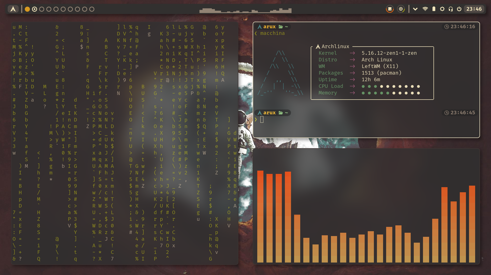
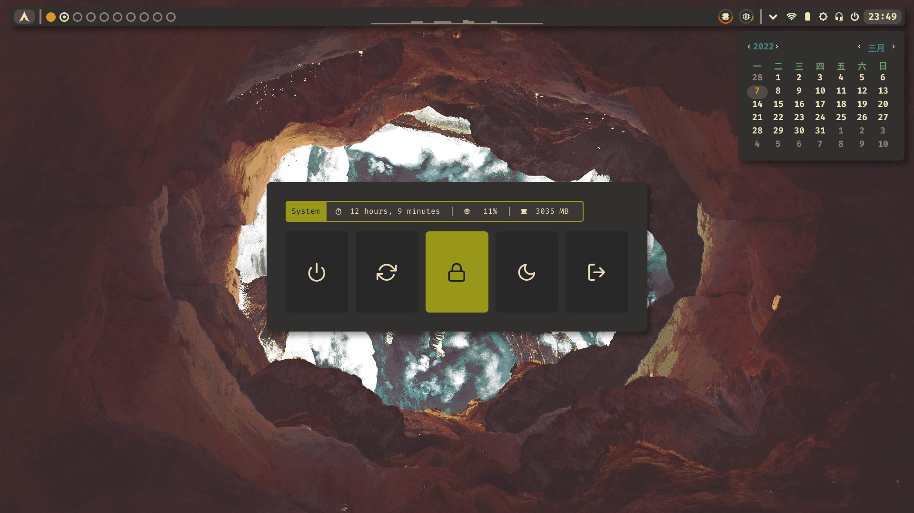

## My dotfiles
### For terminal
+ zsh (shell)
+ starship (shell prompt)
+ zoxide (smarter cd)
+ vivid (ls_color theme tool)
+ lf (file manager)
+ tmux (terminal multiplexer)
+ emacs (editor)
+ neovim (editor)
##### Utilities
+ exa
+ ripgrep
+ fzf
+ skim

### For desktop application
##### widgets and launcher
+ eww
+ polybar
+ rofi
+ dunst
##### window manager
+ leftwm
+ bspwm
+ sxhkd (X hotkey daemon)
+ picom (window compton at xorg)
##### terminal emulator
+ alacritty
+ kitty
+ st
##### others desktop application
+ qutebrowser (browser, vim like)

### Install requirements
#### only terminal
+ git
+ fzf
+ [fd](https://github.com/ogham/exa/releases)
+ [exa](https://github.com/sharkdp/vivid/releases)
+ starship (curl -sS https://starship.rs/install.sh | sh)
+ zoxide (curl -sS https://webinstall.dev/zoxide | bash)
+ direnv
+ wget or curl
#### full
+ mimeo
+ handlr
+ nsxiv
+ scrot
+ maim
+ ueberzug (lf image preview)
+ imagemagick
+ i3lock-color
+ greenclip
+ eww req
+ firacode nerd font and custom icon font
#### command
``` bash
sh -c "$(curl -fsLS git.io/chezmoi)" -- init --apply mathsketch
```
#### home structure
    HOME  
    ├── .config  
    ├── .cache  
    ├── .local  
    │   ├── bin  
    │   └── share  
    ├── Books  
    ├── Desktop  
    ├── Documents  
    ├── Downloads  
    ├── Misc  
    ├── Music  
    ├── Pictures  
    ├── Repository  
    ├── Scripts  
    ├── Source  
    ├── test  
    ├── Videos  
    └── VM  
## Screenshots


